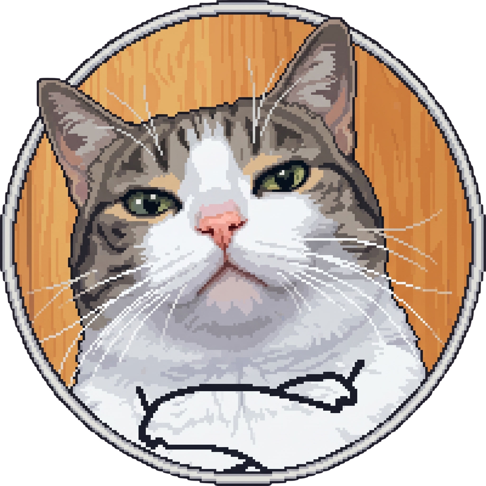
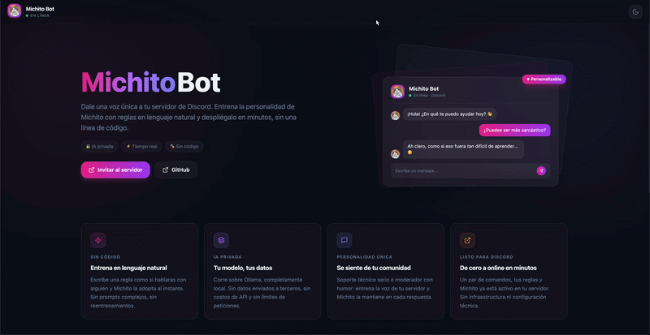

<div align="center">

  

  <h1>Michito Bot</h1>

  <p><strong>An open-source Discord bot with a trainable personality, local-first AI, and a virtual-pet soul.</strong></p>

  <p>
    Teach it to talk like your community in plain language. Run it on your own hardware. Keep it alive — together.
  </p>

  <p align="center">
    
    
    
    
  </p>

  <p align="center">
    
    
    
    
  </p>

  <p align="center">
    
    
    
  </p>

  <hr />

  

</div>

## 🐾 What is Michito Bot?

Michito Bot is a Discord bot you can teach to talk like *your* community.

Write a rule like *"be sarcastic"* or *"talk like a pirate"* in plain language and Michito adopts it instantly — no prompt engineering, no retraining. It runs on **local LLMs via Ollama** so your data never leaves your machine, and ships with a **Next.js web demo** to play with rules visually before bringing them into Discord.

It is evolving into a **virtual mascot** with hunger, energy, health, and mood — a pet your whole server keeps alive together. See the [Roadmap](#️-roadmap) for what is next.

## ✨ Features

- 🎭 **Train a personality in natural language** — add rules from Discord (`/train`) or the web UI; they apply to every reply.
- 🔒 **Local-first AI** — uses your own [Ollama](https://ollama.com) model. No third-party API keys, no usage costs, no data leaving your box.
- 🐱 **Two interaction modes** — explicit slash commands (`/chat`) and ambient replies when someone mentions a trigger word (`michi`, `michito`, …).
- 🧪 **Web demo** included — a polished Next.js page to add rules and chat, useful for tuning a personality before deploying.
- 🏠 **Per-server memory** — every guild has isolated rules and settings; what works on one server stays on that server.
- 🧠 **Knowledge-base ready** — Postgres + pgvector schema in place for embeddings (RAG / fine-tuning come next).
- 🧩 **Modular monorepo** — bot, worker, web, and shared packages move independently behind a Turbo + pnpm workspace.
- 🧷 **Anti-abuse foundations** — channel allow-lists, role policies, mention sanitisation, and audit logging hooks.

## 🏗️ Architecture

```
                    ┌──────────────────────────────────────┐
                    │           PostgreSQL + pgvector      │
                    │   guilds · rules · knowledge · logs  │
                    └──────▲───────────▲──────────▲────────┘
                           │           │          │
              ┌────────────┘           │          └────────────┐
              │                        │                       │
      ┌───────┴──────┐         ┌───────┴──────┐        ┌───────┴──────┐
      │   apps/bot   │         │  apps/worker │        │   apps/web   │
      │ (discord.js) │         │   (BullMQ)   │        │  (Next.js)   │
      │              │         │              │        │              │
      │ slash cmds   │         │ scheduled    │        │ rules UI     │
      │ ambient chat │         │ jobs · ticks │        │ chat demo    │
      │ trigger AI   │         │ embeddings   │        │ landing page │
      └──────┬───────┘         └──────┬───────┘        └──────┬───────┘
             │                        │                       │
             └────────────────────────┴───────────────────────┘
                                      │
                           ┌──────────┴──────────┐
                           │                     │
                     ┌─────┴─────┐        ┌──────┴──────┐
                     │   Redis   │        │   Ollama    │
                     │ (queues)  │        │ (local LLM) │
                     └───────────┘        └─────────────┘
```

### Monorepo layout

```
michito-bot/
├── apps/
│   ├── web/                # Next.js 15 demo (rules panel + chat)
│   ├── bot/                # discord.js — slash commands + ambient replies
│   └── worker/             # BullMQ worker (background jobs)
├── packages/
│   ├── ai/                 # LLM providers (Ollama today; pluggable)
│   ├── db/                 # Prisma schema + generated client
│   ├── discord/            # Slash-command router + interaction helpers
│   └── shared/             # Cross-package types and utilities
├── infra/docker/           # Postgres + pgvector, Redis, Ollama (compose)
├── assets/                 # Avatar, demo gif, marketing assets
├── data/                   # Local JSONL store for training examples
└── turbo.json              # Build pipeline
```

### Tech stack

| Layer       | Choice                                                   |
| ----------- | -------------------------------------------------------- |
| Language    | TypeScript (Node ≥ 24)                                   |
| Bot         | discord.js 14                                            |
| Web         | Next.js 15, React 19, Tailwind CSS, GSAP                 |
| Worker      | BullMQ + ioredis                                         |
| AI          | Ollama (local), pluggable provider in `@michito/ai`      |
| Database    | PostgreSQL 17 + pgvector, Prisma                         |
| Infra       | Docker Compose (Postgres + Redis + Ollama)               |
| Tooling     | Turborepo, pnpm workspaces, ESLint, tsc                  |

## 🚀 Quick start

The recommended path uses Docker for Postgres, Redis, and Ollama — one command bootstraps every dependency.

### 1. Prerequisites

- **Node.js ≥ 24** (recommended via [nvm](https://github.com/nvm-sh/nvm))
- **pnpm** via Corepack
- **Docker Desktop** (or any Docker engine)
- A Discord application with a bot token — [developer portal](https://discord.com/developers/applications)

### 2. Install

```bash
git clone https://github.com/<your-fork>/michito-bot.git
cd michito-bot

nvm install 24 && nvm use 24
corepack enable
corepack prepare pnpm@9.15.5 --activate

pnpm install
cp .env.example .env
```

Fill in at least:

```env
DISCORD_BOT_TOKEN=...
DISCORD_CLIENT_ID=...
DISCORD_DEV_GUILD_ID=...    # your test server ID — enables instant command updates
OLLAMA_MODEL=tinyllama       # or any model you have pulled locally
```

### 3. Boot infrastructure

```bash
pnpm infra:up                # Postgres + Redis + Ollama via Docker
docker exec -it ollama ollama pull tinyllama   # or your chosen model
```

### 4. Database

```bash
pnpm --filter @michito/db exec prisma migrate dev --name init
pnpm --filter @michito/db db:generate
```

### 5. Run

```bash
pnpm dev                                # everything in parallel
# or run a single app:
pnpm --filter @michito/web dev          # web demo on :3000
pnpm --filter @michito/bot dev          # Discord bot
pnpm --filter @michito/worker dev       # background worker
```

The web demo is at <http://localhost:3000>. The bot logs in and registers slash commands against `DISCORD_DEV_GUILD_ID` for instant updates.

<details>
<summary><strong>Native setup (no Docker)</strong> — if you prefer a host PostgreSQL</summary>

Make `psql` available, then create the dev databases and enable the `vector` extension:

```bash
export PATH="/opt/homebrew/opt/postgresql@17/bin:$PATH"   # Homebrew on macOS

psql -d postgres -c "CREATE DATABASE michito;"
psql -d postgres -c "CREATE DATABASE michito_shadow;"
psql -d michito        -c "CREATE EXTENSION IF NOT EXISTS vector;"
psql -d michito_shadow -c "CREATE EXTENSION IF NOT EXISTS vector;"
```

Update `DATABASE_URL` and `SHADOW_DATABASE_URL` in `.env` to point at your host instance. Install Redis and Ollama natively (`brew install redis ollama`) or skip the worker/AI features.

</details>

## 🛠️ Development

### Useful scripts

| Command                                             | What it does                       |
| --------------------------------------------------- | ---------------------------------- |
| `pnpm dev`                                          | Run every app in watch mode        |
| `pnpm build`                                        | Build the whole workspace          |
| `pnpm lint` / `pnpm typecheck`                      | Lint / type-check everything       |
| `pnpm infra:up` / `pnpm infra:down`                 | Start / stop the Docker stack      |
| `pnpm --filter @michito/<app> <script>`             | Target one workspace package       |
| `pnpm --filter @michito/db exec prisma studio`      | Open the DB explorer               |

### Inviting the bot to a test server

In the [Discord Developer Portal](https://discord.com/developers/applications) → your app → **OAuth2 → URL Generator**:

- Scopes: `bot` + `applications.commands`
- Permissions: only what you need to test (start small)

Open the generated URL and authorise it on a server you own.

### Slash command scope

Discord caches **global** commands for up to an hour, so during development register them per-guild:

- **Dev (instant updates)** — set `DISCORD_DEV_GUILD_ID` and run `pnpm --filter @michito/bot dev`.
- **Production (all servers)** — `NODE_ENV=production pnpm --filter @michito/bot dev` *or* `DISCORD_COMMANDS_SCOPE=global pnpm --filter @michito/bot dev`.

### Environment variables

| Variable                | Purpose                                                  |
| ----------------------- | -------------------------------------------------------- |
| `DISCORD_BOT_TOKEN`     | Bot token from the developer portal                      |
| `DISCORD_CLIENT_ID`     | App ID — used to register slash commands                 |
| `DISCORD_DEV_GUILD_ID`  | Guild for instant command updates in dev                 |
| `DISCORD_COMMANDS_SCOPE`| `guild` (default in dev) or `global`                     |
| `DATABASE_URL`          | Main Postgres URL (Prisma)                               |
| `SHADOW_DATABASE_URL`   | Shadow DB used by `prisma migrate dev`                   |
| `REDIS_URL`             | BullMQ + future rate-limit storage                       |
| `OLLAMA_BASE_URL`       | Ollama HTTP endpoint (default `http://localhost:11434`)  |
| `OLLAMA_MODEL`          | Model tag served by Ollama (e.g. `tinyllama`)            |

See `.env.example` for the full list.

## 🗺️ Roadmap

- ✅ **MVP** — slash commands, ambient replies, training rules (JSONL), web demo, local Ollama provider.
- 🔜 **v1 — Virtual mascot.** Hunger, energy, health, and mood with a tick loop. New commands: `/feed`, `/play`, `/sleep`, `/pet`, `/heal`, `/status`, `/revive`. Death is a recoverable state with a tombstone embed and an admin-gated revive. Rules move from JSONL into Prisma so the bot and web share state.
- 🔮 **v2 — Depth & economy.** Items, a shop, XP/levels, quests, leaderboards, GDPR-friendly data export/forget, and an opt-in public status page.
- ✨ **Beyond.** Multi-pet (one per user), evolution / breed packs, voice presence, and a plugin system for self-hosters.

The v1 design is documented in detail and ready to build.

## 🤝 Contributing

Issues and pull requests are welcome. Please:

- Run `pnpm lint && pnpm typecheck` before opening a PR.
- Avoid committing secrets — `.env` is git-ignored for a reason.
- Keep changes scoped: one app or package per PR when possible.

## 📄 License

Released under the [MIT License](./LICENSE). Self-hosting your own instance is encouraged — bring your own bot token, swap in your favourite Ollama model, and make it your community's cat.
